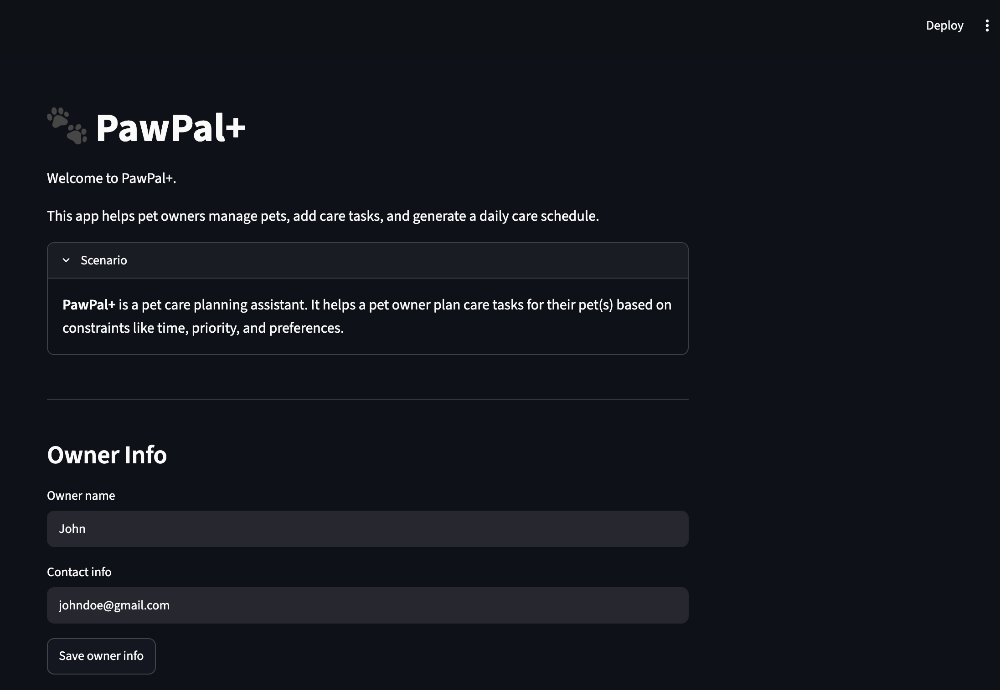
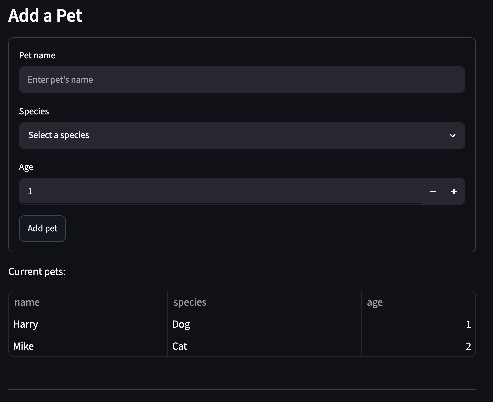
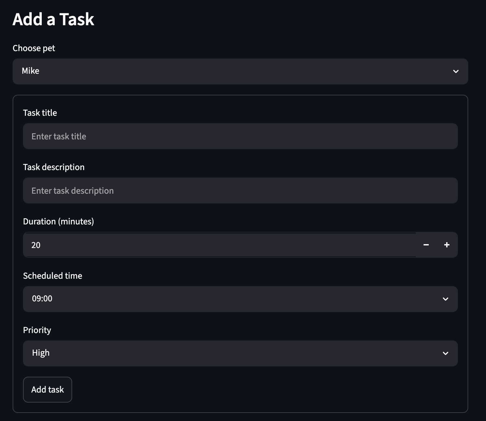
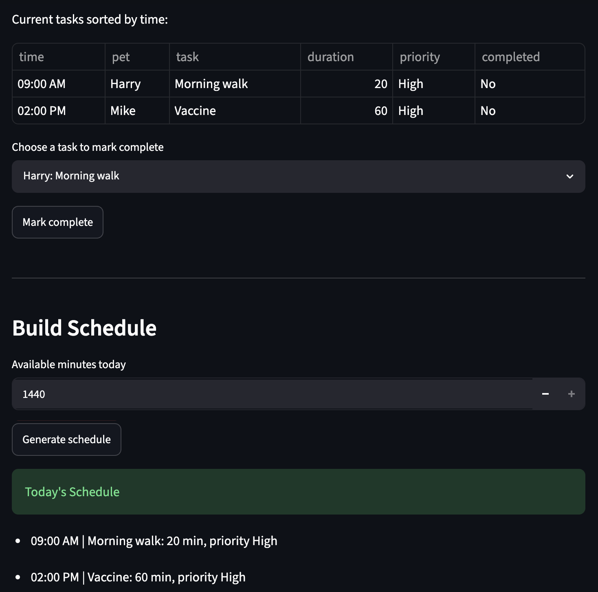

# 🐾 PawPal+

PawPal+ is a Streamlit-based pet care management application that helps pet owners organize their pets' daily care routines. The application allows users to manage multiple pets, schedule care tasks, prioritize activities, detect scheduling conflicts, and generate an organized daily schedule.

This project was built using Python, Object-Oriented Programming (OOP), and Streamlit while demonstrating scheduling algorithms, automated testing, JSON data persistence, and AI-assisted software development.

---

## ✨ Features

- 🐶 Manage multiple pets
- 📝 Add and organize pet care tasks
- ⏰ Schedule tasks with specific times
- ⭐ Priority-based scheduling
- 📅 Chronological task sorting
- ⚠️ Scheduling conflict detection
- 🔁 Daily and weekly recurring tasks
- ✅ Mark tasks as completed
- 💾 Save and load data using JSON
- 🧪 Automated testing with Pytest
- 🎨 Streamlit user interface with task formatting and emojis

---

## 🛠️ Technologies Used

- Python 3
- Streamlit
- Pytest
- JSON
- Object-Oriented Programming (OOP)
- Git & GitHub

---

## 🚀 Getting Started

### Clone the repository

```bash
git clone https://github.com/bhavikak99/pawpal-plus.git
cd pawpal-plus
```

### Install dependencies

```bash
python -m venv .venv
source .venv/bin/activate      # Windows: .venv\Scripts\activate
pip install -r requirements.txt
```

### Run the application

```bash
streamlit run app.py
```

### Run the automated tests

```bash
python3 -m pytest
```

---

# 🖥️ Sample Output

```text
Next Available Slot
-------------------
09:30 AM

All Tasks
---------
- 09:00 AM | 🐕 Morning Walk | 30 min | Priority: Low | ⏳ Pending
- 07:30 AM | 🍽️ Breakfast | 15 min | Priority: High | ✅ Complete
- 07:30 AM | 🍽️ Breakfast | 15 min | Priority: High | ⏳ Pending
- 09:00 AM | 💊 Medication | 10 min | Priority: Medium | ✅ Complete

Completed Tasks
---------------
- 07:30 AM | 🍽️ Breakfast | 15 min | Priority: High | ✅ Complete
- 09:00 AM | 💊 Medication | 10 min | Priority: Medium | ✅ Complete

Incomplete Tasks
----------------
- 09:00 AM | 🐕 Morning Walk | 30 min | Priority: Low | ⏳ Pending
- 07:30 AM | 🍽️ Breakfast | 15 min | Priority: High | ⏳ Pending

Biscuit's Tasks
---------------
- 09:00 AM | 🐕 Morning Walk | 30 min | Priority: Low | ⏳ Pending
- 07:30 AM | 🍽️ Breakfast | 15 min | Priority: High | ✅ Complete
- 07:30 AM | 🍽️ Breakfast | 15 min | Priority: High | ⏳ Pending

Tasks Sorted by Time
--------------------
- 07:30 AM | 🍽️ Breakfast | 15 min | Priority: High | ✅ Complete
- 09:00 AM | 🐕 Morning Walk | 30 min | Priority: Low | ⏳ Pending
- 09:00 AM | 💊 Medication | 10 min | Priority: Medium | ✅ Complete
- 07:30 AM | 🍽️ Breakfast | 15 min | Priority: High | ⏳ Pending

Conflict Warnings
-----------------
⚠️ Conflict: 'Morning Walk' and 'Medication' are both scheduled at 09:00.

Today's Schedule
----------------
- 07:30 AM | 🍽️ Breakfast | 15 min | Priority: High | ⏳ Pending
- 09:00 AM | 🐕 Morning Walk | 30 min | Priority: Low | ⏳ Pending

Persistence Check
-----------------
Loaded owner: Bhavika
Loaded pets: 2
```

---

# 🧪 Testing PawPal+

Run the automated test suite:

```bash
python3 -m pytest
```

The automated tests verify:

* Task completion
* Task addition
* Task sorting by scheduled time
* Daily recurring task creation
* Conflict detection

Successful test run:

```text
=================================================================================== test session starts ===================================================================================
platform darwin -- Python 3.14.5, pytest-9.1.1, pluggy-1.6.0
collected 5 items

tests/test_pawpal.py .....                                                                                                                                                           [100%]

==================================================================================== 5 passed in 0.02s ====================================================================================
```

**Confidence Level:** ⭐⭐⭐⭐☆ (4/5)

The automated test suite verifies the core scheduling functionality, including task completion, task management, sorting, recurring tasks, and conflict detection. While the implemented features work correctly, additional edge cases such as overlapping task durations and more advanced scheduling strategies could be explored in future improvements.

---

# 📐 Smarter Scheduling

| Feature           | Method(s)                                                                  | Notes                                                                               |
| ----------------- | -------------------------------------------------------------------------- | ----------------------------------------------------------------------------------- |
| Priority scheduling | `Scheduler.prioritize_tasks()`                                           | Tasks are sorted by priority first (High → Medium → Low), then by scheduled time when priorities are equal. |
| Task sorting      | `Scheduler.sort_by_time()` and `Scheduler.prioritize_tasks()`              | Tasks can be sorted chronologically or by priority.                                 |
| Filtering         | `Scheduler.filter_tasks_by_status()` and `Scheduler.filter_tasks_by_pet()` | Tasks can be filtered by completion status or by pet name.                          |
| Conflict handling | `Scheduler.detect_conflicts()`                                             | Displays warnings when two tasks are scheduled at the same time.                    |
| Recurring tasks   | `Scheduler.create_next_recurring_task()`                                   | Daily and weekly tasks automatically generate the next occurrence after completion. |

---

## 💾 Data Persistence

PawPal+ can save owner, pet, and task data to `data.json` so information can persist between runs.

Persistence is handled with:

- `Task.to_dict()` / `Task.from_dict()`
- `Pet.to_dict()` / `Pet.from_dict()`
- `Owner.to_dict()` / `Owner.from_dict()`
- `Scheduler.save_to_json()`
- `Scheduler.load_from_json()`

The system converts custom Python objects into dictionaries before saving them as JSON, then reconstructs the objects when loading the file.

---

## 🎨 Professional UI Formatting

PawPal+ includes user-friendly formatting to make tasks easier to read in the Streamlit interface.

Formatting features include:

- Emojis based on task type, such as 🐕 for walks, 🍽️ for feeding, 💊 for medication, 🛁 for grooming, and 🏥 for vet-related tasks.
- Clear task statuses using ✅ Complete and ⏳ Pending.
- Chronological task tables that show time, pet, task, duration, priority, and completion status.

These formatting helpers are implemented in `app.py` using `format_task_title()` and `format_status()`.

---

# 📸 Demo Walkthrough

1. Enter the owner's name and contact information, then save the details.
2. Add one or more pets by providing the pet's name, species, and age.
3. Create care tasks for each pet by entering the task title, description, duration, scheduled time, and priority.
4. Mark completed tasks using the **Mark Complete** button to update their completion status.
5. Generate the daily schedule to view tasks prioritized for the day. Tasks are displayed in chronological order, and scheduling conflicts are highlighted with warning messages.

**Screenshot or video:**








